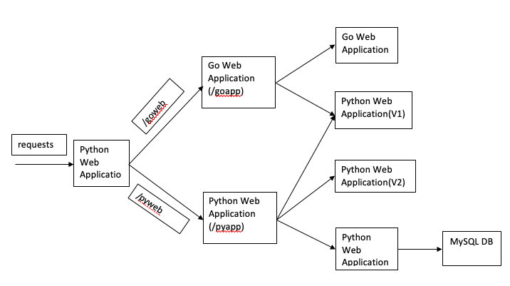

# Micro Services

This document helps you to build Micro Services with Python and Golang web Application on Docker and Kubernetes.

Microservices is an approach to develop small services that each run in its own process. We should develop microservices instead of one service (a monolithic approach) for a multitude of benefits, including:

Microservices are smaller in size Microservices are easier to develop, deploy, and debug, because a fix only needs to be deployed onto the microservice with the bug, instead of across the board Microservices can be scaled quickly and can be reused among different projects Microservices work well with containers like Docker Microservices are independent of each other, meaning that if one of the microservices goes down, there is little risk of the full application shutting down

- [Architecture](#Architecture)
- [Build Micro Services](#Build-Micro-Services)
- [Deploy Micro Services](#Deploy-Micro-Services)
- [Access the Micro Services](#Access-the-Micro-Services)

## Architecture 

Below is the Architecutre of micro services with multiple frontend and backend applications. 



Here frontend used as Python Flask Web Application, Mid and Backends are used Go web Applications and Python Flask Applications. 

## Build Micro Services

Based on above architecture, you can build the docker images as per below or else you can directly use it from https://hub.docker.com/r/anguda/micro-services

```
$ git clone https://github.com/angudadevops/micro-services.git

$ cd micro-services

$ docker-compose build 
```

## Deploy Micro Services

Recommended way is using kubernetes, but if you want explore docker images you can use docker-compose

### Using Docker Compose

First Build Backend Services of Docker Images as per build 

```
$ git clone https://github.com/angudadevops/micro-services.git

$ cd micro-services
```

Update the host ip in docker-compose with below command and run docker-compose 
```
$ sed -ie "s/hostip/$(hostname -I | awk '{print $1}')/g" docker-compose.yml

$ docker-compose up -d 
``` 

### Using Kubernetes 

If you have kubernetes cluster you can use `microservice.yaml` and deploy the Full Stack of Micro services. 

```
$ kubectl apply -f microservice.yaml
```

## Access the Micro Services

Access the Micro services with frontend python app as per below

### using docker compose 

Access with FrontEnd application with below url where <host-ip> is your docker host IP
```
http://<host-ip>:5000/pyweb

http://<host-ip>:5000/goweb

http://<host-ip>:5000/pyapp

http://<host-ip>:5000/goapp
```

### Using Kubernetes

Once you deployed the Applications using `microservices.yaml`, run the below commands and access the frontend application

```
$ kubectl patch svc python-frontend -p '{"spec":{"type":"NodePort"}}'

$ kubectl get svc python-frontend 

http://<host-ip>:nodePort/goweb

http://<host-ip>:nodePort/pyweb

http://<host-ip>:nodePort/goapp

http://<host-ip>:nodePort/pyapp
```

## Cleanup

Run the below command to clean up docker-compose images and containers 
```
docker-compose down --rmi all
```

Run the below command to remove all objects on kubernetes 
```
kubectl delete -f microservice.yaml
```
